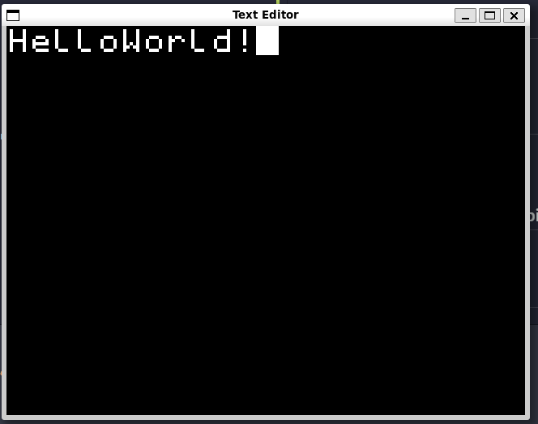

# TextEditor
Text Editor implemented in C using SDL2.

## Dependencies
- SDL2
- SDL2_IMAGE

## Usage
### Run `make`
### Use `./te` to run the text editor

## Keybinds
- `Ctrl =` for zoom in
- `Ctrl -` for zoom out

## Not yet implemented keybinds
- `Ctrl s` for save

## Features in the future
- Opening an existing text document using command line arguments